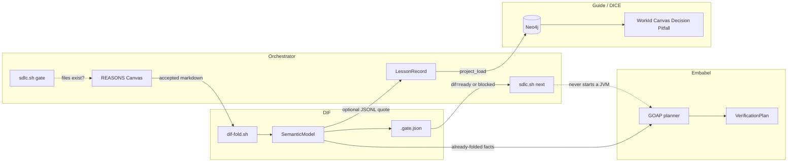
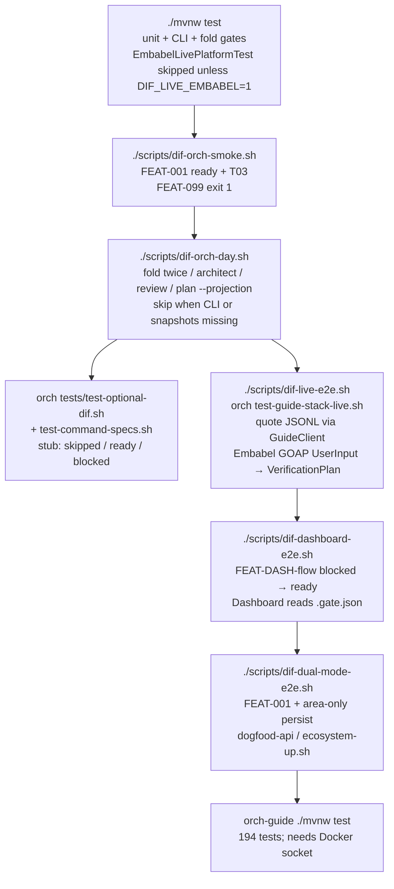
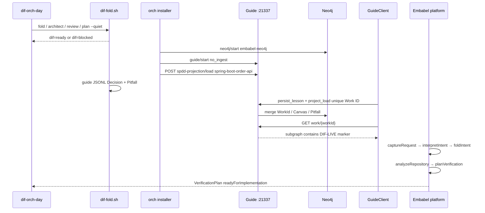
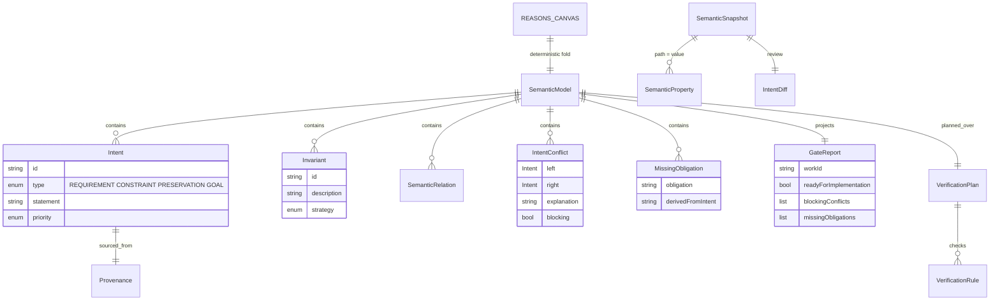
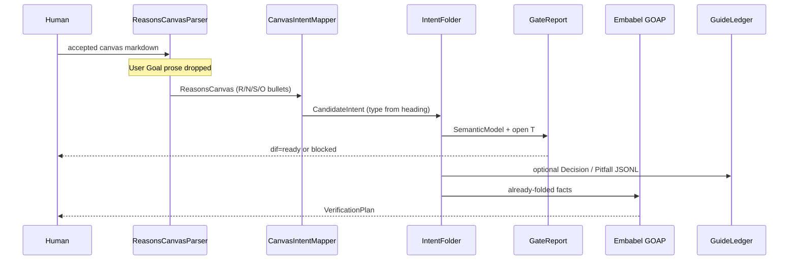
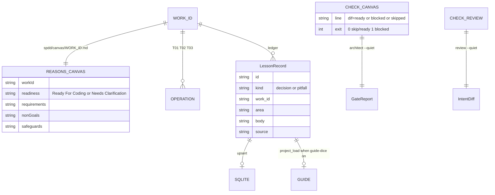
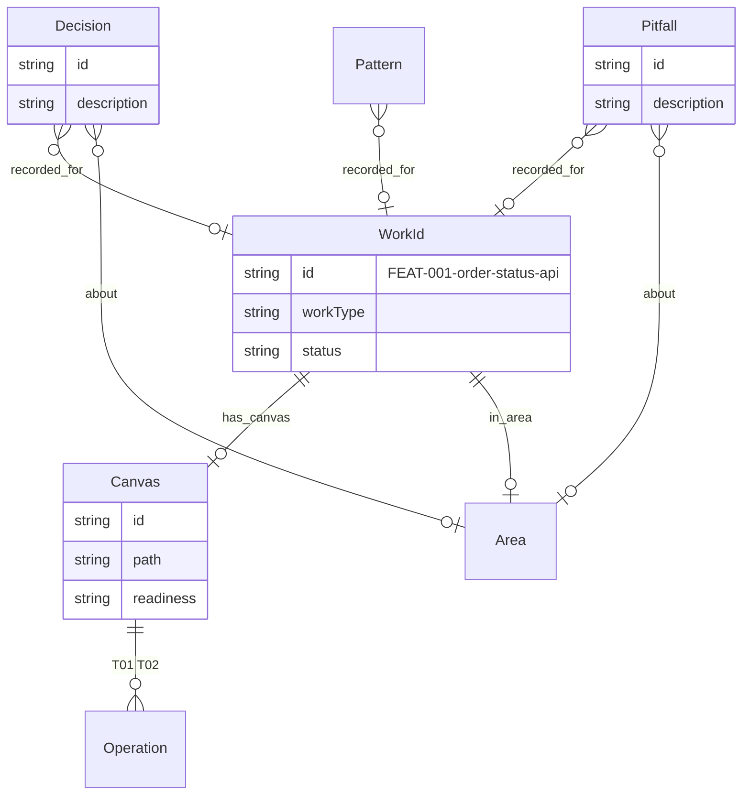
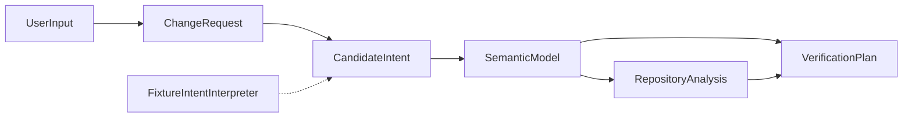

# embabel-dif

Prototype exploring how a **Deterministic Intent Folding (DIF)**-style semantic layer can sit next to Embabel's typed blackboard and planners. The idea **is** that pairing: fold freezes intent; Embabel plans over the freeze. The fold is Embabel-free so other consumers (the orchestrator) can use the same model.

```text
LLM = probabilistic interpreter / generator
DIF = semantic intent substrate
Embabel = deterministic planner / orchestrator
Verifier = deterministic acceptance boundary
```

This is **not** an implementation of any proprietary Merly DIF algorithm.

**Start with the reasoning, then the spec:**

| Doc | Job |
| --- | --- |
| [`docs/REASONING.md`](docs/REASONING.md) | Why this exists, why Embabel, why the orchestrator, DICE vs DIF, the path |
| [`docs/DIF_EMBABEL_PROTOTYPE.md`](docs/DIF_EMBABEL_PROTOTYPE.md) | What to build (IR, fold, planner, verifier, phases) |
| [`docs/RELATIONSHIP_SDLC_SPDD.md`](docs/RELATIONSHIP_SDLC_SPDD.md) | How a REASONS Canvas becomes a checkable projection |
| [`docs/FOLD_ITERATION.md`](docs/FOLD_ITERATION.md) | Steal ideas from cousins; ten steps to iterate the fold |
| [`docs/ORCH_INTEGRATION_ROADMAP.md`](docs/ORCH_INTEGRATION_ROADMAP.md) | Daily orch loop, attach rules, integration test ladder |
| [`docs/BLOG_DIF_ORCH_EMBABEL.md`](docs/BLOG_DIF_ORCH_EMBABEL.md) | Publication source: three layers, how far we take the idea |
| [`docs/DATA_INGEST.md`](docs/DATA_INGEST.md) | How a canvas or change-request becomes each model |

Mermaid for the working test flow and each system's data model is in [Systems, tests, and data models](#systems-tests-and-data-models) below.

Index: [`docs/README.md`](docs/README.md).

## What is stubbed

| Phase | Status |
| --- | --- |
| 1. Typed semantic model + deterministic fold | Working |
| 1b. REASONS canvas → SemanticModel CLI | Working (`./scripts/dif-fold.sh`) |
| 2. Embabel GOAP to `VerificationPlan` | Working (fixture path, no LLM required) |
| 3. LLM code generation | Stub (`LaterPhaseActions`) |
| 4. Deterministic verification | Semantic diff works; code/test checks stubbed |
| 5. Repair loop from `VerificationFailure` | Types only |
| 6. Persistent `.dif/` memory | Seed files + write snapshot stub |

Milestone 1 path:

```text
ChangeRequest → CandidateIntent → SemanticModel → RepositoryAnalysis → VerificationPlan
```

The first use case is:

> Add refresh-token rotation without changing existing login behavior.

## Layout

```text
docs/DIF_EMBABEL_PROTOTYPE.md   spec
src/main/java/com/embabel/dif/
  domain/                       typed IR and blackboard objects
  dif/                          fold, conflicts, missing obligations
  agent/                        Embabel actions + interpreters
  verifier/                     intent diff + verification rules
  memory/                       .dif/ persistence stub
  scenario/                     refresh-token fixture
.dif/                           versioned semantic memory seed
```

## Requirements

- Java 21
- Maven (wrapper included)
- Optional: `OPENAI_API_KEY` or `ANTHROPIC_API_KEY` for non-fixture change requests

## Commands

```bash
./mvnw test
./scripts/dif-orch-smoke.sh
./scripts/dif-orch-day.sh
./scripts/dif-live-e2e.sh   # reuses orch Guide+Neo4j; optional live Embabel
./scripts/dif-dashboard-e2e.sh   # fold → orch Dashboard readout (no JVM on Refresh)
./scripts/dif-dual-mode-e2e.sh   # structured Work ID + unstructured area capture
./scripts/ecosystem-up.sh        # full install on dogfood-api (no Cursor-only / skip-if-missing)
./scripts/dif-fold.sh --canvas examples/canvases/FEAT-001-order-status-api.md
./scripts/dif-fold.sh architect --projection .dif/projections/FEAT-099-pagination-conflict.json
./scripts/dif-fold.sh review --before examples/snapshots/login-before.json --after examples/snapshots/login-auth-broken.json
./scripts/dif-fold.sh plan --canvas examples/canvases/FEAT-001-order-status-api.md
./scripts/shell.sh
```

`dif-fold` does not start Embabel. `fold` writes `.dif/projections/<WORK-ID>.json`
and a stable `.gate.json` (`readyForImplementation`, `blockingConflicts`,
`missingObligations`) that a script can read without parsing stdout.
`architect` and `review` fail closed from a projection or `IntentDiff` (exit `1`
= not Ready For Coding / invariants not preserved). `plan` builds a
`VerificationPlan` from the folded model. `--guide` / `guide` writes optional
Guide JSONL. `--alloy` writes an Alloy sketch; no extra binary is required.
`dif-orch-smoke.sh` folds the harvested orch canvases and asserts those exit
codes plus `.gate.json`. Existing orch commands may call
`scripts/orch-attach/check-canvas.sh` as a silent gate: one line
`dif=ready|blocked|skipped` (missing DIF is skip, not a new daily `next`).
`fold` / `architect --quiet` print that same line. Review of an orch
canvas uses `examples/snapshots/order-status-*.json` (safeguard paths),
not the login fixtures. `check-review.sh` skips when those files are
absent. `plan --projection` builds a `VerificationPlan` from a folded
model without re-reading markdown. `./scripts/dif-orch-day.sh` is the
scripted day. `./scripts/dif-live-e2e.sh` reuses the orchestrator's
existing `tests/test-guide-stack-live.sh` to boot Guide+Neo4j, quotes
DIF JSONL through `GuideClient`, then boots the Embabel Spring
platform. It does not put Embabel or Guide inside `sdlc.sh next`.

In the Embabel shell:

```text
fold
fold-local
intent-diff
x "Add refresh-token rotation without changing existing login behavior."
```

The known refresh-token wording is handled by `FixtureIntentInterpreter`, so fold does not need an LLM. Other requests go through `LlmIntentInterpreter`.

## Design rule

Use stochastic reasoning to discover knowledge. Once a fact is accepted, fold it into typed intents, invariants, relations, and deterministic checks that Embabel can plan over.

## Systems, tests, and data models

Three systems stay separate. Tests prove they can talk without collapsing into one runtime.



| System | Owns | Must not own |
| --- | --- | --- |
| **Orchestrator** | Who acts when. Work ID, canvas file, `next`, process gates, lesson ledger. | The fold. Starting Embabel. Being a planner. |
| **DIF** | What must stay true. Same accepted canvas → same `SemanticModel`. | Daily orientation. Picking the Work ID. Replacing the canvas. |
| **Embabel** | What action to take on *already folded* facts (optional JVM path). | The fold itself. `sdlc.sh next`. |
| **Guide** | What we learned before (retrieve-only graph). | Ready For Coding. Fail-closed review. |

### Working test flow

What we actually run. Default CI is the first box. Live Guide/Embabel is opt-in and reuses the orch harness.



Live E2E sequence (the three-way path that already passed here):



### DIF data model

Human contract is still the canvas. The machine contract is a regenerable `SemanticModel`. `.gate.json` is what orch reads.



### How data gets in

Hop-by-hop map: [docs/DATA_INGEST.md](docs/DATA_INGEST.md). Tests:
`DataModelIngestTest`.



A second ingest path is Embabel-only: `UserInput` → `ChangeRequest` →
`FixtureIntentInterpreter` or `LlmIntentInterpreter` → the same
`IntentFolder`. The LLM writes `CandidateIntent`, never the freeze.

Canvas sections map like this: **R** → `REQUIREMENT`, **N** non-goals → `CONSTRAINT`, **S** safeguards → `PRESERVATION`. A requirement vs non-goal pair becomes a blocking `IntentConflict`. An operation with no matching work (T03 on FEAT-001) becomes a `MissingObligation`. Review compares two `SemanticSnapshot`s; safeguard paths come from the canvas **S** lines, not login fixtures.

Optional Guide quote from the same model (`GuideLedger`):

```json
{"kind":"Decision","workId":"FEAT-001-…","text":"<invariant>","source":"INV-…"}
{"kind":"Pitfall","workId":"FEAT-001-…","text":"<conflict or Missing: T03 …>","source":"conflict"}
```

### Orchestrator data model

Orch owns process, not fold. Files and ledger rows are the contract `sdlc.sh gate` already understands.



`next` / `architect` / `code` / `review` call `check-canvas.sh` or `check-review.sh` when the CLI is on PATH. Missing CLI or missing review snapshots → `dif=skipped` (exit 0). Present CLI + conflict or dropped safeguard → `dif=blocked` (exit 1). Orch CI uses `tests/fixtures/dif-fold-stub.sh` so it does not need Maven.

### Guide and Embabel data models

Guide is a retrieve-only NamedEntity graph in Neo4j. Embabel is a GOAP blackboard over DIF types. Neither replaces the canvas.





Live Embabel (`EmbabelLivePlatformTest`, `DIF_LIVE_EMBABEL=1`) runs:

`captureRequest` → `interpretIntent` → `foldIntent` → `analyzeRepository` → `planVerification`

The refresh-token wording uses `FixtureIntentInterpreter` (no LLM). Conflicts stay on the `VerificationPlan` (`readyForImplementation=false`); they are not a GOAP precondition Embabel 1.5 cannot treat as an action post.

Live Guide quote uses a **unique** Work ID (`FEAT-DIF-LIVE-…`) so it does not collide with orch’s already-projected `FEAT-001` from `examples/spring-boot-order-api`.
